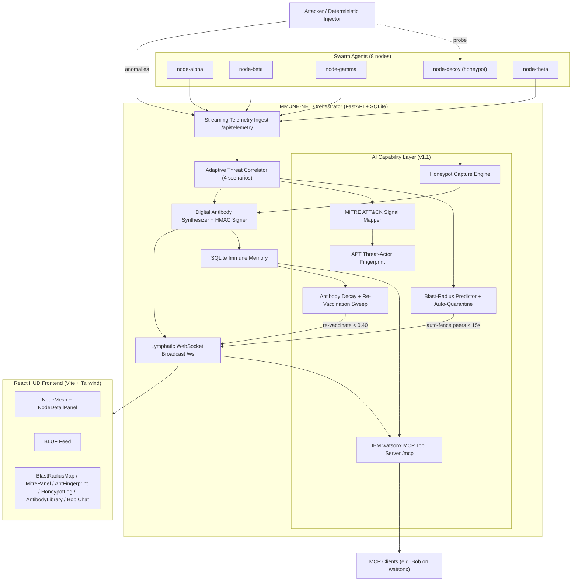

# IMMUNE-NET System Architecture

> **Prototype Version:** 1.1 (Hackathon Prototype + AI Agentic Capability Layer)

## 1. Overview

IMMUNE-NET is a decentralized, AI-driven network security system modeled on biological immunity. Version 1.0 delivered the core cyber-biological swarm (observation, adaptive correlation, autonomous containment, signed digital antibodies, lymphatic broadcast, SQLite immune memory). Version 1.1 adds the **AI Agentic Capability Layer**: MITRE ATT&CK kill-chain signal mapping, APT threat-actor fingerprinting, pre-emptive blast-radius containment, a honeypot decoy node, antibody half-life decay with re-vaccination, and an IBM watsonx.x MCP tool server.

## 2. High-Level Architecture



## 3. Capability Layer Modules

| Module | Module | File | Responsibility |
| --- | --- | --- | --- |
| MITRE ATT&CK mapping | Detection engine | `orchestrator/app.py` | Confirmed threats carry MITRE technique IDs + tactics for kill-chain modeling |
| APT fingerprinting | `orchestrator/apt_fingerprint.py` | Cosine similarity against 5 APT profiles (APT41, FIN7, Lazarus, Cozy Bear, Scattered Spider) ranking top-3 actor candidates per incident |
| Blast-radius containment | `orchestrator/blast_radius.py` | Shared-subnet risk × service exposure × connection-rate factor; nodes with disease latency < 15 s are auto-quarantined |
| Honeypot decoy | `common/nodes.py`, `orchestrator/honeypot.py` | `node-decoy` node captures probes for 4 profiles and synthesizes decoy antibodies |
| Antibody decay | `common/schemas.py`, `agent/immune_memory.py`, `orchestrator/app.py` | Half-life decay formula, 60-min background sweep, auto re-vaccination when effective confidence < 0.40 |
| IBM watsonx MCP | `orchestrator/bob_mcp.py` | JSON-RPC 2.0 tool server over HTTP (GET manifest / POST calls) |

### 3.1 Blast-Radius Model

```
risk = shared_subnet_risk x connection_factor x service_exposure
fall_time_seconds = max(2, round(FALL_TIME_CONSTANT / risk))   # FALL_TIME_CONSTANT = 32.0
auto-quarantine peer when fall_time_seconds < 15
```

Example: `node-beta` infecting `node-gamma` over a shared subnet yields a disease latency of ~11 s, so `node-gamma` is pre-emptively fenced without waiting for a confirmed signal.

### 3.2 Antibody Decay

```
effective_confidence = base_confidence * (0.5 ** (age_hours / half_life_hours))   # default half-life 72 h
status: active >= 0.60 | expired < 0.40
re-vaccination: synthesized_at reset + version bump when effective confidence < 0.40
```

### 3.3 MCP Surface

Service `POST /mcp` with JSON-RPC 2.0. Eight synchronous tools plus the async `run_simulation` tool:

`get_fleet_status`, `get_node_detail`, `quarantine_node`, `release_node`, `get_active_incidents`, `get_antibody_library`, `get_blast_radius`, `run_simulation`.

## 4. Data Flow

1. Agent nodes stream telemetry; Isolation Forest anomalies trigger threat correlation.
2. On confirmation, the orchestrator writes the incident with MITRE signal map and runs APT fingerprinting.
3. A signed digital antibody is synthesized, persisted in SQLite, and broadcast over WebSocket.
4. The blast-radius predictor auto-quarantines at-risk peers immediately.
5. The honeypot node logs probes and synthesizes decoy antibodies.
6. A periodic sweep re-vaccinates decaying antibodies.
7. MCP clients (and the React HUD) query the same memory and state through `/mcp` and typed WebSocket events.

## 5. React Frontend

Rebuilt on Vite 8 + React 19 + Tailwind v4. New capability components: `StatBar`, `NodeMesh` (+ `NodeDetailPanel` slide-in with quarantine/release), `BlastRadiusMap`, `MitrePanel`, `AptFingerprint`, `BlufFeed`, `AntibodyLibrary`, `HoneypotLog`, `BobChat`, `Timeline`. Live data plane in `src/hooks/useImmuneLive.js` (typed WS events + REST polling).

## 6. Verification

`python acceptance_test.py` runs 12 benchmark rows including 5 new AI capability tests (APT41 attribution, pre-emptive blast-radius quarantine, decay expiry, MCP fleet status, honeypot capture).